# Week 2 Lab — Networking, Packet Capture, and Man-in-the-Middle
**Hiya Mehta** **4/15/2026**

### Introduction and Materials
I will be using a modern web browser, chrome, and Wireshark on my Windows laptop to capture network traffic. I hope to better understand how unencrypted credentials and session tokens are transmitted over the wire and how a Man-in-the-Middle attack can lead to total account impersonation without a password.

### Steps to Reproduce
1. Ran ipconfig to find my IP address
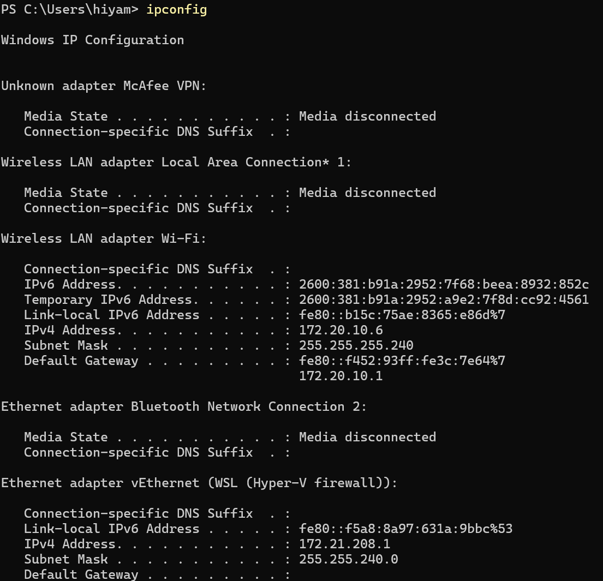
2. Opened Wireshark
3. Logged into HuskyHub while Wireshark was running
4. In the Wireshark filter bar, searched for `http.request.method == "POST"`
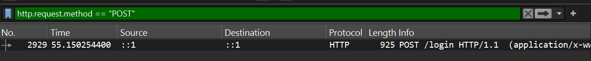
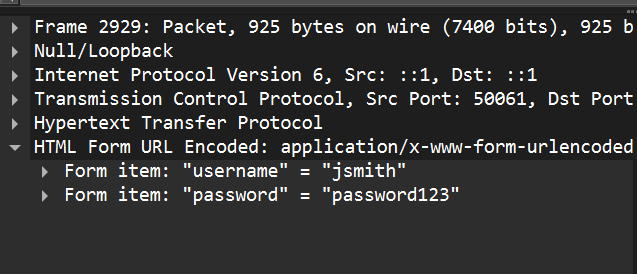
5. Found my session cookie by searching `http.cookie` in the Wireshark filter bar
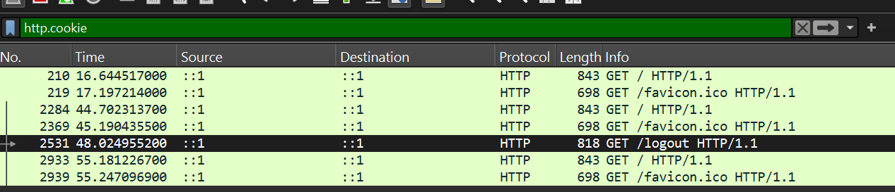
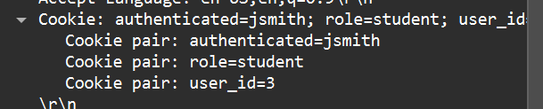
6. Found my IP address and gateway IP address using:
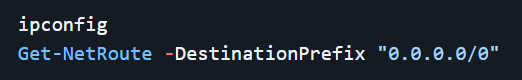
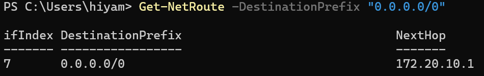
    * My IP address (attacker) : 172.20.10.6
    * The gateway IP address: 172.20.10.1
7. Found the victim's IP address by running `arp -a`:
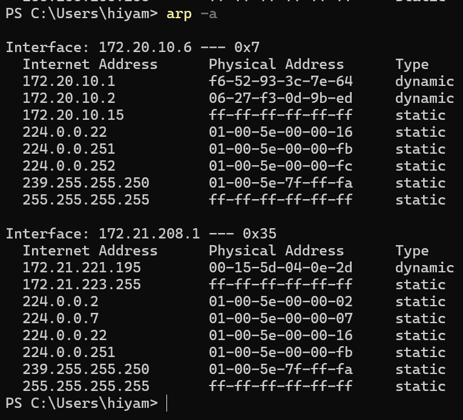
    * The victim’s IP address: 172.20.10.2
8. Made sure PowerShell was running
9. Linked attacker and victim machines by navigating to `labs/week-02/scripts/` then using:
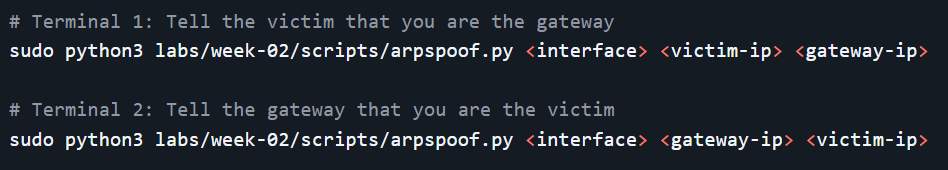
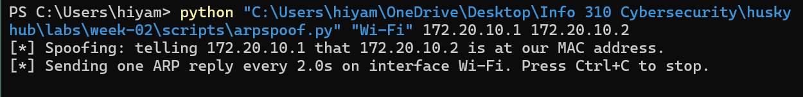
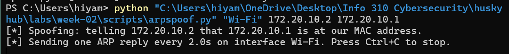
10. Captured the victim’s session cookie by filtering `ip.addr == 172.20.10.2 && http.cookie` in the Wireshark search bar
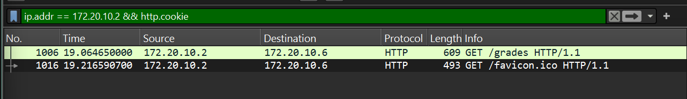
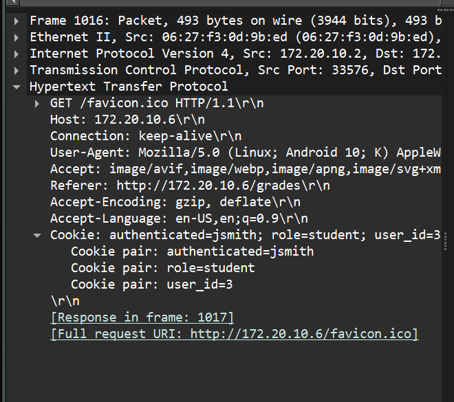
11. Opened Chrome Developer Tools on the attacker machine under Application > Cookies and replaced my session cookie values with the victim's stolen tokens.
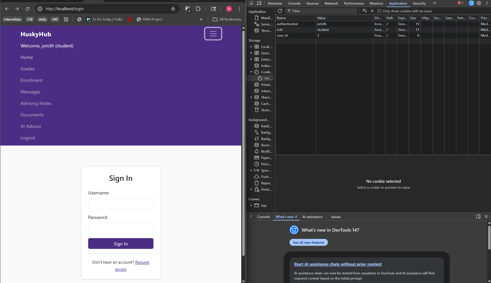
12. Stopped the attack and ran `arprestore.py` to clean the ARP caches of both devices.
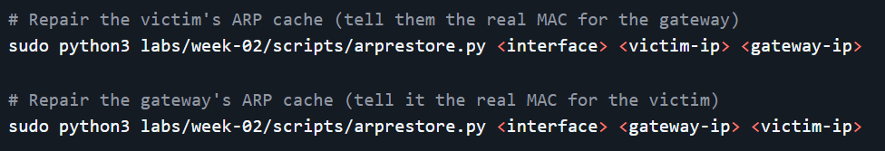
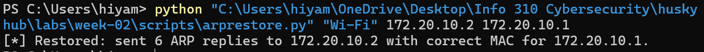
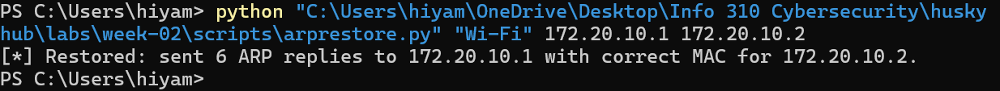

### Class Principles
1. **You impersonated your lab partner using only their session cookie — no password required. What does this tell you about how HuskyHub authenticates users after login? What is the difference between authentication and session management, and which one failed here?**
Once a user signs in, plain text cookies are assigned to them that allow them to stay logged in (so they don’t need to keep logging in every time they reopen the site). The difference between authentication and session management is that authentication is what you do to prove who you are, whereas session management is the thing that remembers you. The thing that failed is the session management. Because the cookie was sent over unencrypted HTTP and was not tied to a specific IP, whoever has it is treated as the authenticated user.

2. **At which OSI layer would HTTPS protect against each of the two attacks performed today (credential capture and cookie theft)? Would HTTPS fully prevent both? Explain any remaining risk.**
HTTPS protects against the two attacks in layer 7, the Application Layer. HTTPS fully prevents both attacks by encrypting the data before it leaves the device. An attacker performing ARP spoofing would still see the packets, but they would be fully encrypted. HTTPS uses digital certificates to prove a website is valid. If the application doesn’t verify the certificates or if an attack steals the certificate, they can trick your laptop into trusting a malicious connection. (https://www.veracode.com/security/man-middle-attack)

3. **The ARP spoofing attack required you to be on the same local network as your target. What are realistic scenarios in which an attacker could be on the same network as a user of a public web application?**
This attack could be done on public wi-fi in a café or shared housing where we are on the same network.

### Hacker Mindset and Conclusion
**Contrarian: This attack requires no login, no exploit, and no interaction with the application at all. What assumption about "security" does this challenge?**
- The attack challenges the idea that security is only about the app or having a strong password. Most people think that if a website doesn’t have bugs and their password is long, they are safe. But this proves that security actually depends on the whole path of the data taken to get to the server. Since HTTP isn’t encrypted and ARP just trusts whoever talks to it, an attacker can steal everything without ever hacking the website itself. It shows the network is just as important as the app you are using.

**Committed: A committed attacker who captures a valid session cookie does not stop at reading one page. Describe the next three steps they would take.**
- Once a committed attacker steals the session cookie, they would go through the account and download all the person’s private info and messages. Then, they would try to take control of the account by changing the recovery email. Then, they would check if the same login works for other parts of the site, like internal pages or admin settings.

**Creative: How would you design a network attack that captures credentials from many users simultaneously rather than one targeted victim?**
- To steal login info from a lot of people at the same time, I would make a wifi signal and name it something with free in it so people will join without thinking about it. Once they join I can send them a fake login page where when the sign in, I would be able to see and save everyone’s usernames and passwords.