# Lab Report: Cryptography

### Introduction and Materials
In this lab, I will be using my computer to strengthen the security of a web application by fixing vulnerabilities I discovered in previous weeks. I'll be working with tools like bcrypt, OpenSSL, and Wireshark to move away from plaintext data and toward a more secure, encrypted environment. I hope to better understand how securing data while it travels and scrambling it while it's stored actually work to protect user info from hackers.

### Steps to Reproduce
1. Run `docker exec -it huskyhub-huskyhub-db-1 mysql -u user -psupersecretpw huskyhub`
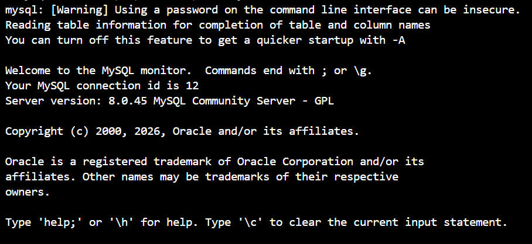
2. Run `SELECT username, password FROM users;`
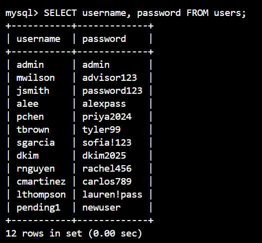
3. Add `bcrypt==4.1.2` to `flash/requirements.txt`
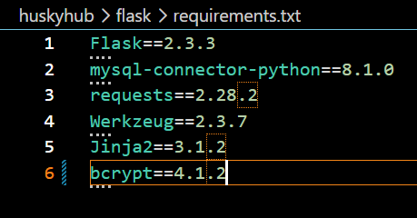
4. Rebuild using `docker compose up --build`
5. Create a new file `flask/app/utils.py` with the following code:
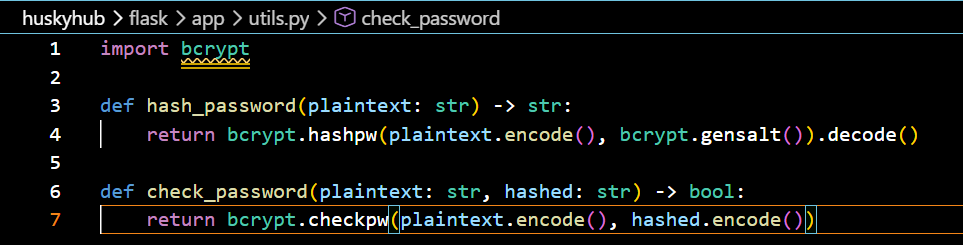
6. Create a new file `flask/migrate_passwords.py` with the following code (code given by Giacomo):
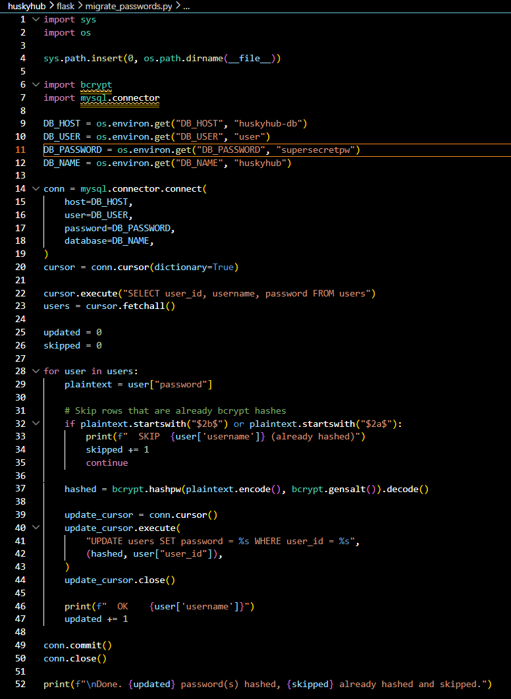
7. Run:
    * `docker cp flask/migrate_passwords.py huskyhub-huskyhub-flask-1:/app/migrate_passwords.py`
    * `docker exec -it huskyhub-huskyhub-flask-1 python migrate_passwords.py`
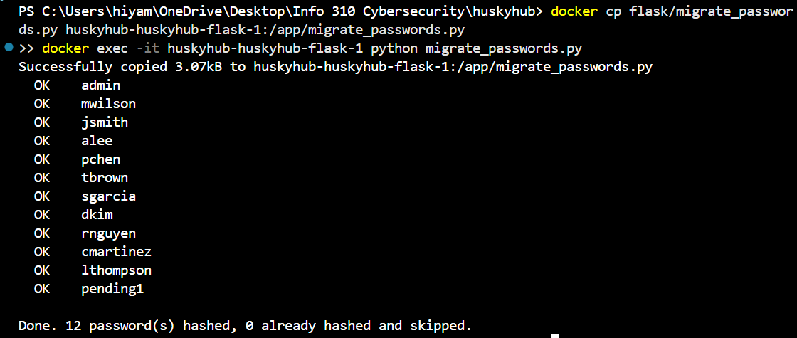
8. In `flask/app/routes/auth.py` import the following in the top of the file (code given by Giacomo):
    * `from ..utils import check_password, hash_password`
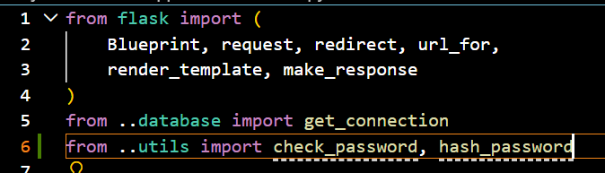
9. Change the login query to the following:
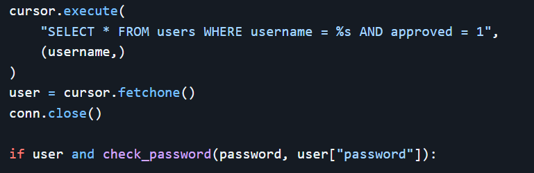
10. Call `hash_password()` before adding the new password into the database:
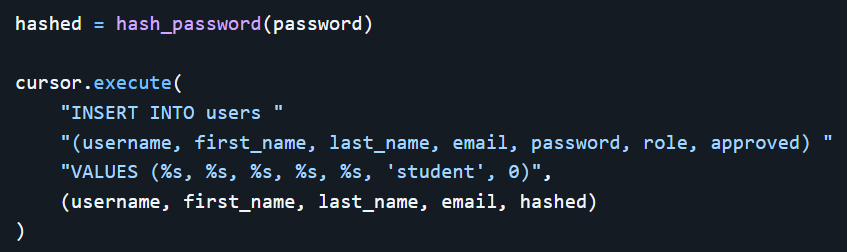
11. Run `docker exec -it huskyhub-huskyhub-db-1 mysql -u user -psupersecretpw huskyhub -e "SELECT username, password FROM users;"`
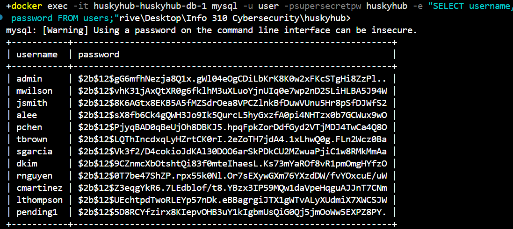
12. Run the following in git bash:
    * `openssl req -x509 -newkey rsa:4096 -keyout nginx/key.pem -out nginx/cert.pem -days 365 -nodes -subj "//C=US\ST=Washington\O=UW\CN=localhost"`
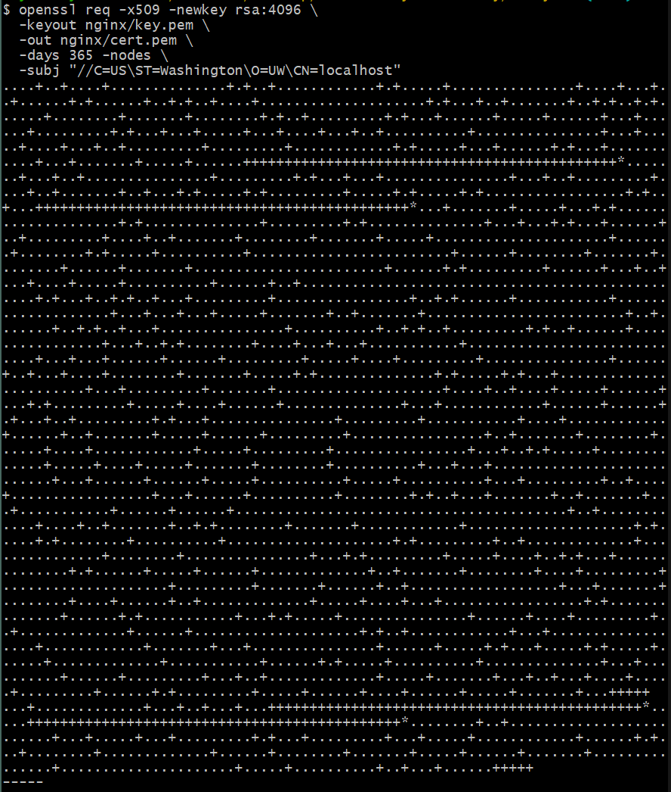
13. Update `nginx/default.conf` to the following code:
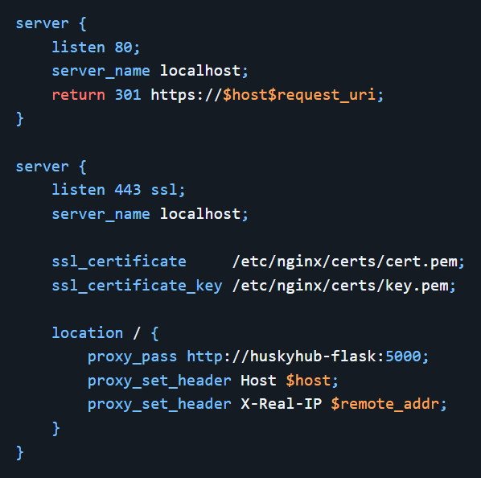
14. Update `docker-compose.yaml` to expose the new port:
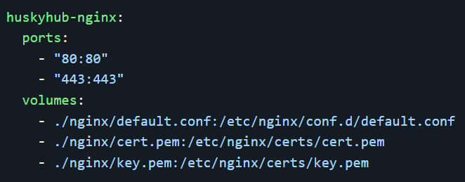
15. Rebuild and open `https://localhost`
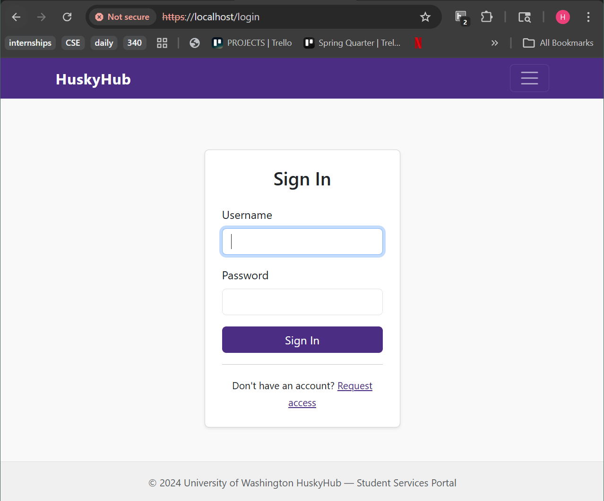
16. Open Wireshark
17. Open the Adapter for loopback traffic
18. Login to localhost
19. Filter for `http.request.method == "POST"`
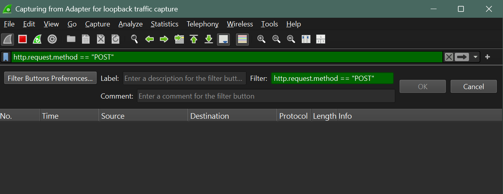
20. Click around and see if there is something new in Wireshark
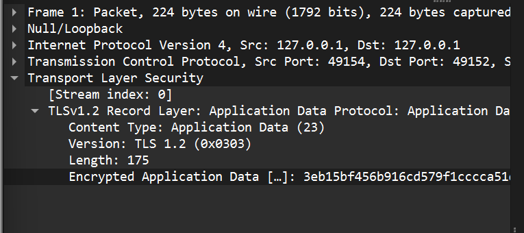

### Class Principles
1. **Explain the difference between encryption and hashing. Why is hashing the correct approach for password storage rather than symmetric encryption?**
Encryption is when you lock data with a key, but you unlock it later to see the original message. Hashing, on the other hand, can not be decrypted. Once you hash something, it’s scrambled forever. Hashing is better for passwords because a server doesn’t actually need to know your real password, it only needs to know if the hash of what you typed matches the hash in the database. This way, if a hacker gets access to the database, all they will see are hashes.

2. **What is a salt in the context of bcrypt? Paste one hash from your database and identify which part of the string is the salt. Why does bcrypt embed the salt in the hash output rather than storing it separately?**
A salt is a random string of characters added to a password before it gets hashed. This makes it so that if two people have the same passwords, their hashes will look completely different.
* **Hash:** `$2b$12$gG6mfhNezja8Q1x.gWlO4eOgCDiLbKrK8K0w2xFKcSTgHi8ZzPl..`
* **Salt:** `gG6mfhNezja8Q1x.gWlO4e`

3. **Your certificate is self-signed. What is the difference between a self-signed certificate and one signed by a Certificate Authority? What specific attack does a CA signature protect against that your certificate does not?**
A self-signed certificate, like writing on a piece of paper that I can drive (example used in class). There is no credibility to it. Certificates with a CA signature allow people to know that the website is secure and meets minimum requirements that make it safe. Without a CA, a hacker could intercept your connection and give you their own fake certificate.

### Hacker Mindset and Conclusion
**Committed: If an attacker obtained a database full of bcrypt hashes, describe the exact process they would use to attempt to crack them. What resources would they need?**
Since hashes can't be decrypted, hackers use a brute force attack to find common passwords. They do this by hashing a whole bunch of common passwords and seeing if the results match the database. To actually decrypt a 10-character password with numbers, upper and lowercase letters, and symbols, it would take 24154 years because of the computing power necessary. For an attack like this, a hack would need a lot of computing power from high-end GPUs.
* https://specopssoft.com/blog/hashing-algorithm-cracking-bcrypt-passwords/
* https://specopssoft.com/blog/brute-force-attack/

**Creative: bcrypt was designed in 1999. What properties would you want in a password hashing algorithm designed today, and does bcrypt still meet them?**
I think it should be impossible to decrypt something that was hashed. Bcrypt is perfect for this because there is no way to decode it, even if a hacker knows exactly how the math works. The only way to find the passwords is to guess.